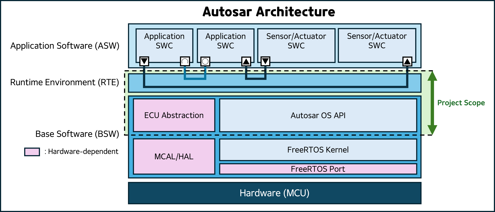

# FreeRTOS-Autosar-Platform

**A lightweight, hardware-independent AUTOSAR software platform based on FreeRTOS.**
---

## 📖 Description

This project is an embedded software platform that manually implements the core layers of **AUTOSAR (RTE, BSW)** on top of the **FreeRTOS kernel**, without relying on commercial AUTOSAR tools.

The goal is to design a **Layered Architecture** that decouples the Application Software (ASW) from the hardware, ensuring portability and scalability.

**Key Implementations:**
1.  **RTE (Runtime Environment):** Manual implementation of Task communication (Sender-Receiver) and synchronization (Client-Server) mechanisms.
2.  **OS Abstraction:** Wrapping FreeRTOS APIs to emulate AUTOSAR OS standard API specifications.
3.  **BSW Abstraction:** Implementation of ECU Abstraction such as CAN/DIO drivers using MCU-specific HAL.

## ⚖️ License & Credits

This project includes third-party software components.

### 1. Project Source Code
The application code and OS abstraction layer developed in this repository are released under the **MIT License**.

### 2. Third-Party Components
* **FreeRTOS Kernel**:
    * Copyright (C) Amazon.com, Inc. or its affiliates.
    * Licensed under the **MIT License**.
    * [Official Website](https://www.freertos.org/)

* **SEGGER SystemView & RTT Target Sources**:
    * Copyright (C) SEGGER Microcontroller GmbH.
    * Used for educational/non-commercial purpose.
    * [Official Website](https://www.segger.com/products/development-tools/systemview/)

* **STM32 HAL Driver**:
    * Copyright (C) STMicroelectronics.
    * Licensed under the **BSD-3-Clause**.

## ⚠️ Scope & Limitations (RTE Implementation)

This project focuses on the **internal mechanisms** of the AUTOSAR Runtime Environment (RTE) and Operating System (OS) for that.
Unlike commercial AUTOSAR workflows that rely on code generation tools for the Runtime Environment (RTE), this project adopts a **"Static / Manual RTE"** approach.

* **Out of Scope:** Automatic RTE generation from ARXML, SWC Description parsing.
* **Implemented:** Manually coded RTE APIs (`Rte_<Swc>.h`, `Rte_<Swc>.c`) to simulate the standard Virtual Function Bus (VFB) behavior.

## 🛠️ Development Environment & Dependencies

This project relies on the following third-party software components.
To reproduce the build environment, please ensure the specified versions are used.

### 0. Development Tools (IDE & Compiler)
| Software | Version | Note |
| :--- | :--- | :--- |
| **STM32CubeIDE** | **2.0.0** | GCC-based Toolchain |
| **STM32CubeMX** | **6.12.0** | GUI Tool for Peripheral settings |

### 1. Real-Time Operating System (RTOS)
| Component | Version | License | Source Link |
| :--- | :--- | :--- | :--- |
| **FreeRTOS Kernel** | **202406.04 LTS** | MIT | [FreeRTOS-LTS](https://github.com/FreeRTOS/FreeRTOS-LTS) |

### 2. Debugging & Tracing Tools
Used for system visualization and real-time tracing.

| Component | Source / Version | Note |
| :--- | :--- | :--- |
| **SEGGER SystemView** | [GitHub (`a17c54e`)](https://github.com/SEGGERMicro/SystemView/tree/a17c54e) | Target Sources |
| **SEGGER RTT** | [GitHub (`ad6970d`)](https://github.com/SEGGERMicro/RTT/tree/ad6970d) | Real-Time Transfer |

> **Version Note:**
> Since these repositories do not use standard semantic versioning tags, specific **Commit Hashes** are used to ensure build reproducibility.

## 🎯 Reference Implementations (Supported Targets)

This platform architecture is designed to be portable. The repository currently supports the following hardware targets:

| Board Name | MCU | Core |
| :--- | :--- | :--- |
| **STM32F407G-DISC1** | STM32F407VGT6 | Cortex-M4 |
| **NUCLEO-F767ZI** | STM32F767ZI | Cortex-M7 |

> **Portability Note:**
> The core logic in `Source/` is shared across targets. Switching the target only requires changing the `Targets/` directory and HAL configuration.

## 🚀 Development Roadmap
- [x] Phase 1: Environment Setup

    Porting FreeRTOS to STM32F767ZI and establishing a multi-target directory structure.

- [x] Phase 2: OS Abstraction Layer

    Wrapping FreeRTOS to implement OSEK APIs (e.g., ActivateTask, SetEvent).

- [x] Phase 3: RTE Core Implementation

    Implementing Sender-Receiver (Queue) and Client-Server (Blocking) communication patterns.
    
    Ensuring data consistency using Implicit Communication (Shadow Buffers).

- [x] Phase 4: BSW Simulation (Stubbing)
    
    Implementing virtual CAN interrupts using Software Timers and basic PduR/Com stack.
    
    Integration Test.
