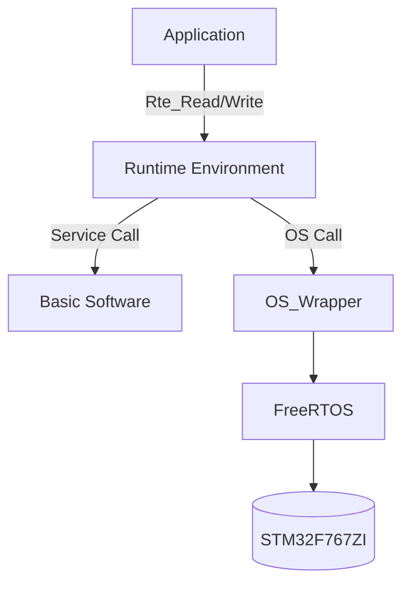

# FreeRTOS-Autosar-Platform

**A lightweight AUTOSAR software platform based on FreeRTOS for STM32F767ZI.**

---

## 📖 Description

This project is an embedded software platform that manually implements the core layers of **AUTOSAR (RTE, BSW)** on top of the **FreeRTOS kernel**, without relying on commercial AUTOSAR tools.

The goal is to design a **Layered Architecture** that decouples the Application Software (ASW) from the hardware, ensuring portability and scalability.

**Key Implementations:**
1.  **RTE (Runtime Environment):** Manual implementation of Task communication (Sender-Receiver) and synchronization (Client-Server) mechanisms.
2.  **OS Abstraction:** Wrapping FreeRTOS APIs to emulate OSEK/AUTOSAR OS standard specifications.
3.  **BSW Simulation:** Implementation of virtual CAN/DIO drivers (Stub) to verify logic without physical equipment.

## 🚀 Roadmap
[x] Phase 1: Environment Setup

* Porting FreeRTOS to STM32F767ZI and establishing a multi-target directory structure.

[ ] Phase 2: OS Abstraction Layer

* Wrapping FreeRTOS to implement OSEK APIs (e.g., ActivateTask, SetEvent).

[ ] Phase 3: RTE Core Implementation

* Implementing Sender-Receiver (Queue) and Client-Server (Blocking) communication patterns.

* Ensuring data consistency using Implicit Communication (Shadow Buffers).

[ ] Phase 4: BSW Simulation (Stubbing)

* Implementing virtual CAN interrupts using Software Timers and basic PduR/Com stack.

[ ] Phase 5: Functional Safety Base

* Implementing E2E (End-to-End) data protection mechanisms and memory protection.
